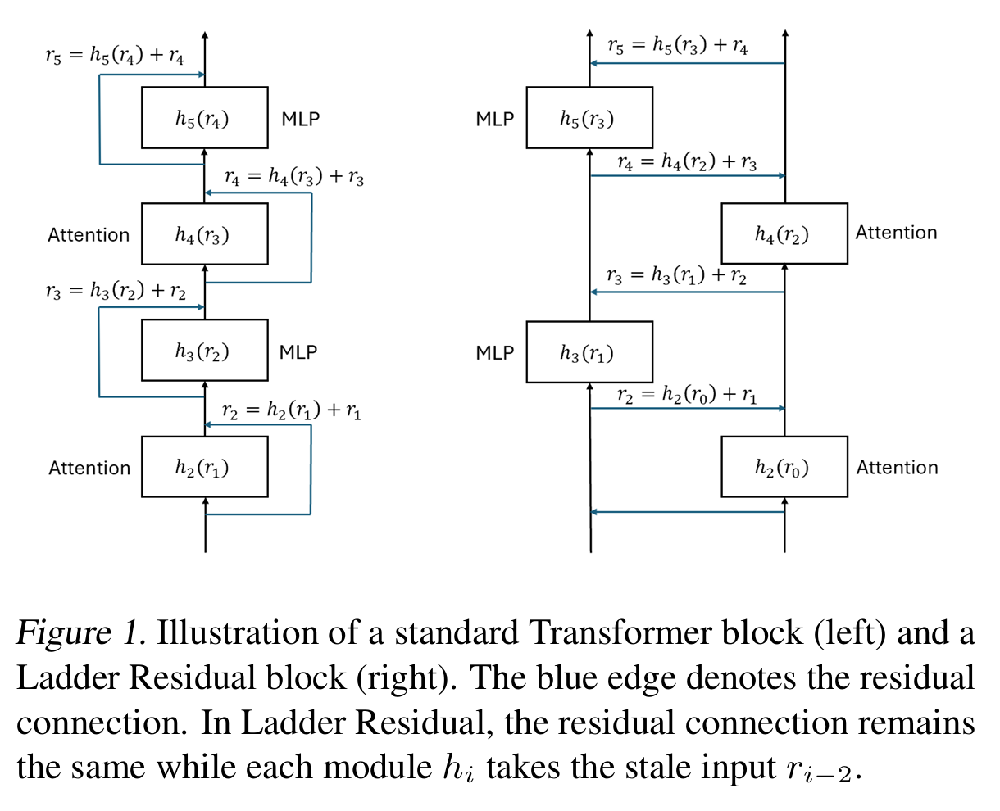

## Hide the communication latency for multi-gpu LLM serving with Ladder Residual

As foundation models continues to scale, multi-gpu or even multi-node inference will be even more crucial. For example, the 70 version of llama3 requires 70 * 2 = 140 GB in bfloat16 to even load the model into memory, which necessaite distributed inference. We would want to effectively utilize all GPUs that together serve one model, and tensor parallelism (TP) is a widely adopted approach.

In TP, we divide weights and computation across all devices (the number of devices is referred as the TP degree) and synchronize the results between them. While this helps with both memory efficiency and speed, the synchronization (also referred as communication) turns out to be a major bottleneck of the overall latency. For a 70 model with TP degree 8, the communication can account for 38% of the total inference time. 

In this post, we introduce Ladder-residual, a simple architecture tweak that allows computation and communication to happen in parallel—reducing latency without needing custom kernels or hardware changes.

Here's a quick summary of what Ladder-residual achieves:

* ~30% speedup for LLaMA 3.1-70B (TP=8) and LLaMA 3.1-405B (TP=16), and almost doubled speedup when fast interconnect (NVLink) is not available.
  
* Can be applied to a pretraiend model - we adapt LlaMA 3.1-8B and gained 23% speedup with no accuracy lost
  
* Pure PyTorch level modification, no custom CUDA kernels needed, work on any hardware.

**Our insight is that in addition to system optimizations, one can also redesign the model architecture to decouple communication from computation.** While we only focus on Transformer with Tensor Parallelism here, the design can be easily extended to a different architecture to accelerate any convnetional parallelism patterns.

### Tensor paralleism and GPU communication

Tensor parallelism (TP) is a widely used technique in distributed training/inference. It partitions weights and activations across devices and performs partial computations on each device. Consider a sequence of 2 linear layers with weight matrices $A$ and $B$ and input activation $X$ that is running on 2 GPUs (TP world size of 2), we split $A$ along the output dimension into $[A_1, A_2]$, and split $B$ along the input dimension into $\begin{bmatrix}B_1\\B_2\end{bmatrix}$. Then the output of the sequence of the 2 linear layers can be computed as $(XA)B = (XA_1)B_1 + (XA_2)B_2$ and we effectively partition the computation on the two devices. 

The final summation requires an *AllReduce* operation to aggregate the partial sums on each device, which introduces communication overhead. The *AllReduce* overhead increases with increasing message size and increasing number of devices participating in the *AllReduce*. A transformer layer consists of an attention block and an MLP block: both can be considered as a sequence of two matrix multiplications and therefore fit into the tensor parallelism paradigm described above. Thus each transformer layer contains 2 *AllReduce* operations: one for attention and another for MLP. Denoting the input to the $i^{th}$ block $h_i$ as $x_{i-1}$, the transformer can be viewed as the following sequential structure:

$$x_i^*=h_i(x_{i-1})\\
  x_i=AllReduce(x_i^*) + x_{i-1}\\
  x_{i+1}^* = h_{i+1}(x_i)\\
  x_{i+1} = AllReduce(x_{i+1}^*) + x_i$$

<!--  -->

where the $*$ denotes a partial-sum that requires an *AllReduce* to replicate full output across all the GPUs.

### Ladder residual architecture

From the above, we see why *AllReduce* is blocking: there is a sequential structure between communication and computation in existing model designs: we wait for communication in order to prepare the correct input for the next computation. In the above formula, *AllReduce*($x_i^*$) is blocking $h_{i+1}$ because $h_{i+1}$ needs its output. <ins>[DejaVu](https://arxiv.org/abs/2310.17157)</ins> found that activation changes slowly in Transformer, as the norm of each update $h_{i}(x_{i-1})$ is small compared to the residual. Based on this observation, we hypothesize that maintaining the regular residual connection is enough to restrict the representation shift, and we can feed each module a "stale" input to create overlapping opportunities. In Ladder-residual, we decouple this sequential dependentices by **letting $h_{i+1}$ take $x_{i-1}$ as input instead.**, therefore allows overlap *AllReduce*($x_i^*$) with $h_{i+1}(x_{i-1})$.

The following diagram shows the difference of computation graph for standard Transformer and our Ladder-resiudal Transformer.

### How much speedup can we get under Ladder-residual

To provide a clear picture of what ladder-residual can offer under various setup, we benchmark the token-per-second (TPS) of LLaMA-3.1-70B with and without Ladder-residual below, using TP across 8 H100 GPUs with NVLink interconnect:

| Batch size | Standard transformer | Ladder-residual | Speedup |
|------------|----------------------|-----------------|---------|
| 1          | 77.39                | 101.23          | 1.308   |
| 4          | 258.56               | 331.47          | 1.282   |
| 8          | 475.04               | 595.65          | 1.256   |
| 16         | 843.15               | 1003.35         | 1.190   |
| 32         | 1312.26              | 1553.72         | 1.184   |
| 64         | 1940.99              | 2241.84         | 1.155   |

While Ladder-resiudal is able to provide consistent speedup, we see the speedup diminishes as we increase the batch size, indicating less share of communication in the overall latency. The TPS scaling also becomes sublinear as batch size increases, indicating a saturation of compute.

From another axis, we show the speedup with respect to the model size below, with batch size 4 and TP degree 8:

| Model Size | Standard transformer | Ladder-residual | Speedup |
|------------|----------------------|-----------------|---------|
| 1B          | 2063.50              |  2979.42        | 1.444   |
| 3B          | 1139.88              | 1727.48         | 1.515   |
| 8B          | 902.44              |  1305.52         | 1.447   |
| 34B         | 843.15               | 1003.35         | 1.348   |
| 70B         | 259.62              | 338.5         | 1.301   

Finally, for larger models like Llama-3.1-405B, more than one node is required to serve the model. Due to much slower cross-node communication, tensor parallelism is not traditionally used across nodes. However, with Ladder-residual, using pure TP might be possible. As shown below, Ladder-residual can bring over 30% speedup across different batch size when serving 405B model with TP degree 16.

### Ladder-resiudal can keep up with standard Transofrmer

Okay, speed is great, but what about accuracy? Ladder-residual is a different architecture and we would hope it can perform similarly to standard Transformer. Below we tackle this problem from two angle: training a Ladder-residual model from scratch and adapt a pretrained standard Transformer to it.

We train a 1B and a 3B standard Transformer and same size counterparts with Ladder-residual block (we will refer to it as Ladder Transformer) from scratch on 100B tokens of [FineWeb-edu](https://huggingface.co/datasets/HuggingFaceFW/fineweb-edu) dataset. We also train a Transformer with parallel attention/mlp block, as used in [PaLM](https://arxiv.org/abs/2204.02311), which we refer to as Parallel Transformer. While not proposed for reducing communication, by parallelizing attention and mlp within each layer we can effecitvely cut 50% of the communication therefore we include it as a related alternative for comparison.

 We find that at the 1B model scale, Ladder Transformer achieves performance
 similar to Standard Transformer while beating the Parallel
 Transformer. At 3B parameter scale, we find that Standard
 Transformer is better than Ladder Transformer model with
 3.2% lower perplexity and 1.2 points of absolute difference  in accuracy. The Parallel Transformer has almost the same
 performance as Ladder Transformer at the 3B scale. While experiments at this scale might not be conclusive, we hope we can conduct larger-scale experiment in the future, or if this post might convince you to try it for us :)

 Finally, we demontrate a quick application of Ladder-residual - as a direct drop-in for a pretraiend model. We convert a state-of-the-art open-source model, Llama
3.1-8B-Instruct into a hybrid Ladder Residual structure, by
 applying Ladder Residual to the upper half of the model
 (layers 16-32 for LLaMA-3.1-8B-Instruct). We call this variant Hybrid-Ladder-8B-16L. We report both the zero-shot results and retraining results where we retrain the converted hybrid ladder model with 3B tokens from the[Infinity Instruct](https://huggingface.co/datasets/BAAI/Infinity-Instruct) dataset.

We can see immediately after adaptation, there is a huge performance drop mainly on generative tasks as the computation flow is messed up. But after light retraining, the hybrid Ladder Llama is able to reach the same level of performance with the original Llama. We additionally repotr the result for retraining Hybrid-Ladder-8B-20L (converted last 20 layers to Ladder Residual), and found that there is a slight drop in performance. There is a chance that with
 longer adaptation, or smarter adaptation techniques like dis
tillation or iterative training, we can obtain a Ladder-Llama
 with more layers adapted. We leave the further exploration
 to future work.

### Looking forward

For more details, please check our [paper](https://arxiv.org/abs/2501.06589). We also provide code for [training](https://github.com/IBM/dolomite-engine/tree/main) and [inference](https://github.com/mayank31398/ladder-residual-inference), feel free to try it yourself!

Besides delivering a simple acceleration method, we also hope Ladder-residual inspires more research on the ML algorithm-system co-design.